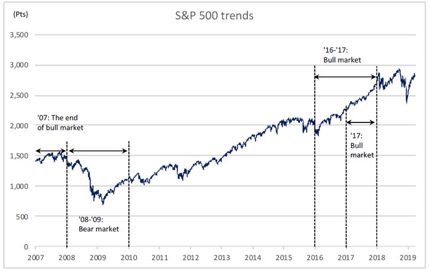
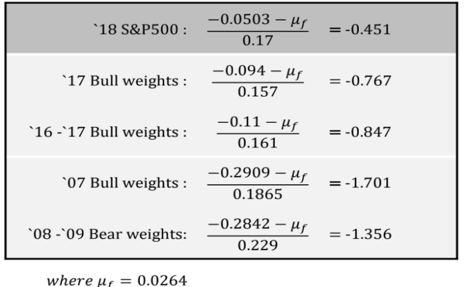

```{r setup, include=FALSE}
knitr::opts_chunk$set(echo = TRUE)
```


```{r, echo=FALSE, message=FALSE}
#install.package() should be called unless libraries are installed
library(Ecdat)
library(quadprog)
library(plyr)
library(tidyverse)
library(xts)
library(tseries)
```

## 1. Introduction

History has shown that the stock market as well as economy moves repeatedly in cycles over and over. However, Investors do not need to radically change their long-term plans, rather implement simple tweaks to their portfolio to help cushion catastrophic losses or extra gains. Adjusting their portfolio allocations along with the market’s flow like the bull or the bear, there are chances to improve outputs compared to well-known indices such as S&P 500.
Surrounded by all the euphoria of a bull market, investors are inclined to feel confident and take more risks. Some industry sectors tend to particularly do well during bull markets and some others do not. Thus, it can be a good strategy to revise the industry weights of a portfolio.

We obtain historical returns of 11 sector ETFs and S&P 500, our benchmark, from 2007 to 2018 at Yahoo Finance. The sector ETFs, made by Vanguard, are all value-weighted to emphasize an industry allocation effect rather than a stock selection effect. In order to analyze the impact from market traits on optimal portfolio, we focus on certain periods as our in-sample periods: 2007, 2008-2009, 2016-2017, and 2017. Through this project, we see if sector allocation portfolio can outperform the market.

## 2. Main objectives and plan

The primary objectives are to derive optimal industry weights by applying the mean-variance optimization, to observe if the portfolios can perform well in out-of-sample periods, and to test their legitimacy by implementing a time series model. The performance of the weights derived under conditions of different periods can provide us with directions about how to construct a portfolio in the future.

Our study is mainly focused on finding a low-risk portfolio which can lead that the quadratic programming is applied to minimize their variance of the daily returns. We set the benchmark’s average daily returns in the four periods as the constraints of the quadratic programming. After finding optimal portfolios, we apply them to the market in our test period of 2018. Their performance with respect to the benchmark in 2018 helps us determine the effects of our portfolio and it is also helpful to figure out the difference in Sharpe ratios between each portfolio and the benchmark. We assume that a naked short-selling is allowed and there is no trading cost accompanied by rebalancing portfolios to adjust weights to our optimal weights everyday.

## 3. Analysis description

### 3.1. Assumptions for market data selection

First of all, we divide the market into 11 different sectors based on WRDS (Wharton Research Data Services)’s GICS industry classification. These include: Communication, Consumer discretionary, Consumer staples, Energy, Financials, Healthcare, Industrials, Information technology, Materials, Real estate and Utilities. 

After then, we decided to use an ETF to represent each sector. An Exchange-Traded Fund (ETF) is type of an investment fund. Just like stocks, it is traded on stock exchanges. There could be different types of assets under an ETF, such as stocks, commodities and bonds.

The reason why we decide to use ETFs rather than select individual stocks is the sector ETFs represent the market’s characteristics better. Through our time period (2007-2018), the numbers/types of stocks constantly changes due to delisting or a IPO. Thus, if the top 5% stocks are selected manually from each sectors, some of the data will have missing values. However, ETFs automatically control the change of stocks in each sector and represent the overall trend throughout the time period. Moreover, ETFs keep the consistency so that the Vanguard ETFs are chosen for our analysis.

### 3.2. Assumptions for market periods selection

```{r pressure, echo=FALSE, out.width = '80%', fig.align="center"}

```


We chose to use four different time periods for two reasons. First, we wanted to see the weight difference based on the market situation. As we can see from the S&P 500 plot above, bull market includes 2007, 2016-2017 and the bear market includes 2008-2009 and 2018. We assumed that the weight allocations of bear vs. bull market would be vastly different. Second, we also wanted to see the effect of length of time. Thus, we tried optimization in both 2 year periods and a 1 year period.

### 3.3. Weight allocation

Traditional weight allocations in the portfolio management is done by managing the weights between different types of assets such as stocks, fixed income and cash. For example, a typical portfolio includes stocks that have high beta and low beta in its combination. However, for the purpose of weight allocations between the sectors of the stock market, the quadratic programming is used to optimize the weight allocation by minimizing its risk. Through the quadratic programming, a portfolio with lower volatility can be achieved and it gains at least the same returns as the benchmark, S&P 500.

For the optimization process, we have set several assumptions below.

i) Short-selling is allowed

ii) Portfolio’s return is same as the market return

iii) Portfolio’s volatility is lower than the market volatility

iv) Sum of weights should be equal to 1

v) Sum of weight multiplied by returns of each sector should be equal to total portfolio return


### 3.4. Time series analysis for returns

The time series forecasting model, ARIMA, is applied to predict future portfolio returns based on the past performances. A prediction using a non-seasonal ARIMA(p,d,q) model is the most appropriate since no seasonal trend has found. The result of Augmented Dickey-Fuller(ADF) test with a p-value 0.01 shows that it is a stationary time series process which allows us to let d be 0. In order to choose parameters, the number of autoregressive (p) and moving average (q), which remove any autocorrelation remainings in the residuals, the number of combinations of these parameters is iterated. Also, the Akaike information criterion (AIC) is used to evaluate the model.

To see if the residuals have no significant patterns and are normally distributed, it is proceeded in making one-step out-of-sample forecast by splitting the whole dataset into 100 samples for training and 1 sample for testing each time, and then calculating the prediction interval.


## 4. Results of statistical analysis and interpretation

### 4.1. Prediction of portfolio returns in 2018

Based on portfolio optimization process, the combinations of weights in four groups are plugged into the 2018 market. To compare the performance, we choose to see the sharpe ratio different between portfolios. Sharpe ratio is also calculated because it is a fair key metric to show the return of an investment compared to its risk. The ratio represent the average return earned in excess of the risk-free 

As we can see from the table, all Sharpe ratios are negative because the 2018 market was a bear market and the market performance was negative. However, we should not just focus on the magnitude of Sharpe ratio, but should focus on each portfolio’s volatility and return. Although returns of 2017 and 2016-2017 portfolios were smaller than the S&P 500, the volatility was lower. We can also see that the performance of 2016 and 2017 weights are much better than that of 2007 and 2008-2009. Both return and volatility underperformed compared to the benchmark.
This is because the market characteristics have drastically changed a lot from the past years. From this, we can see that more recent weights fits better for the future. Even though both 2008-2009 and 2018 markets were bull, the performance was not good. This is because the market driver was vastly different. In 2008-2009, every sector did not perform well because of the macro economical reason, but in 2018, the main reason was the fall of FAANG and IT stocks. The heatmap beneath illustrates clearly the change of weights during the chosen periods.

```{r, echo=FALSE, message=FALSE, warning=FALSE}
gsec_mtkcap_date <- read.csv("total_return.csv",header = T)
SP500 <- read.csv("GSPC.csv",header = T,as.is = T)

Year <- substr(as.character(gsec_mtkcap_date$Date),nchar(as.character(gsec_mtkcap_date$Date))-1,nchar(as.character(gsec_mtkcap_date$Date)))
ret_07 <- gsec_mtkcap_date %>%
  filter(Year =="07")
ret_0809 <- gsec_mtkcap_date %>%
  filter(Year =="08" |Year =="09")
ret_13 <- gsec_mtkcap_date %>%
  filter(Year =="13")
ret_1617 <- gsec_mtkcap_date %>%
  filter(Year =="16" |Year =="17")
ret_17 <- gsec_mtkcap_date %>%
  filter(Year =="17")
ret_18 <- gsec_mtkcap_date %>%
  filter(Year =="18")
#ret_2016_2018 <- ret_date %>%
#  filter(substr(ret_date$Date,1,4) %in% c("2016","2017","2018"))
#ret_2019 <- ret_date %>%
#  filter(substr(ret_date$Date,1,4)=="2019")
growth <- function(df){
  a <- c(NA, tail(df, -1) / head(df, -1) - 1)
  return(a)
}
SP500 <- data.frame(Date = SP500[,1], Adj.close = SP500[, 6])
SP500$return <- sapply(SP500, growth)[,2]
SP500 <- SP500[-1,]
```

```{r, echo=FALSE, message=FALSE, warning=FALSE}
# S&P500 summarization
sp <- read.csv("GSPC.csv", header = T) # import file of S&P500
sp <- data.frame(Date = sp[,1], Adj.close = sp[, 6])
sam1 <- sapply(sp, growth)
sp$return <- sam1[, 2]
sp <- sp[-1, ]
sp$Date <- as.character(sp$Date)
sp$Year <- substr(sp$Date, 1, 4)
sp$Year <- as.numeric(sp$Year)

sp07 <- sp[sp$Year == 2007, ]
sp0809 <- sp[sp$Year == 2008 | sp$Year == 2009, ]
sp1617 <- sp[sp$Year == 2016 | sp$Year == 2017, ]
sp16 <- sp[sp$Year == 2016, ]
sp17 <- sp[sp$Year == 2017, ]
sp18 <- sp[sp$Year == 2018, ]

a07 <- mean(sp07$return)
a0809 <- mean(sp0809$return)
a1617 <- mean(sp1617$return)
a16 <- mean(sp16$return)
a17 <- mean(sp17$return)
a18 <- mean(sp18$return)
```


```{r, echo=FALSE, message=FALSE}
#2007
R = ret_07[ ,3:13] # convert to percentages
mean_vect = apply(R, 2 ,mean)
cov_mat = cov(R)
sd_vect = sqrt(diag(cov_mat))
Amat = cbind(rep(1, 11), mean_vect) # set the constraints matrix
mean_SP500_07 <- SP500 %>%
  filter(substr(SP500$Date,3,4) == "07") %>%
  select(return) %>%
  apply(.,2,mean)
muP = seq(mean_SP500_07, .03, length = 100) # target portfolio means

# for the expect portfolio return
sdP = muP # set up storage for std dev’s of portfolio returns
weights = matrix(0, nrow = 500, ncol = 11) # storage for weights
for (i in 1:length(muP)) # find the optimal portfolios
{
  bvec = c(1, muP[i]) # constraint vector
  result =solve.QP(Dmat = 2 * cov_mat, dvec = rep(0, 11), Amat = Amat, bvec = bvec, meq = 2)
  sdP[i] = sqrt(result$value)
  weights[i,] = result$solution
}
weights07 <- weights[1,]
mufree = .0264 / 253 # input value of risk-free interest rate
pred18on07 <- weights07*ret_18[,c(-1,-2)]
#(mean(apply(pred18on07,1,sum))-mufree)/sd(apply(pred18on07,1,sum))*sqrt(253)
```

```{r, echo=FALSE, message=FALSE}
#2008-09
R = ret_0809[ ,3:13] # convert to percentages
mean_vect = apply(R, 2 ,mean)
cov_mat = cov(R)
sd_vect = sqrt(diag(cov_mat))
Amat = cbind(rep(1, 11), mean_vect) # set the constraints matrix
mean_SP500_0809 <- SP500 %>%
  filter(substr(SP500$Date,3,4) == "08"|substr(SP500$Date,3,4) == "09") %>%
  select(return) %>%
  apply(.,2,mean)
muP = seq(mean_SP500_0809, .03, length = 100) # target portfolio means

# for the expect portfolio return
sdP = muP # set up storage for std dev’s of portfolio returns
weights = matrix(0, nrow = 500, ncol = 11) # storage for weights
for (i in 1:length(muP)) # find the optimal portfolios
{
  bvec = c(1, muP[i]) # constraint vector
  result =solve.QP(Dmat = 2 * cov_mat, dvec = rep(0, 11), Amat = Amat, bvec = bvec, meq = 2)
  sdP[i] = sqrt(result$value)
  weights[i,] = result$solution
}
weights0809 <- weights[1,]
mufree = .0264 / 253 # input value of risk-free interest rate
pred18on0809 <- weights0809*ret_18[,c(-1,-2)]
#(mean(apply(pred18on0809,1,sum))-mufree)/sd(apply(pred18on0809,1,sum))*sqrt(253)
```

```{r, echo=FALSE, message=FALSE}
#2016-17
R = ret_1617[ ,3:13] # convert to percentages
mean_vect = apply(R, 2 ,mean)
cov_mat = cov(R)
sd_vect = sqrt(diag(cov_mat))
Amat = cbind(rep(1, 11), mean_vect) # set the constraints matrix
mean_SP500_1617 <- SP500 %>%
  filter(substr(SP500$Date,3,4) == "16"|substr(SP500$Date,3,4) == "17") %>%
  select(return) %>%
  apply(.,2,mean)
muP = seq(mean_SP500_1617, .03, length = 100) # target portfolio means

# for the expect portfolio return
sdP = muP # set up storage for std dev’s of portfolio returns
weights = matrix(0, nrow = 500, ncol = 11) # storage for weights
for (i in 1:length(muP)) # find the optimal portfolios
{
  bvec = c(1, muP[i]) # constraint vector
  result =solve.QP(Dmat = 2 * cov_mat, dvec = rep(0, 11), Amat = Amat, bvec = bvec, meq = 2)
  sdP[i] = sqrt(result$value)
  weights[i,] = result$solution
}
weights1617 <- weights[1,]
mufree = .0264 / 253 # input value of risk-free interest rate
pred18on1617 <- weights1617*ret_18[,c(-1,-2)]
#(mean(apply(pred18on1617,1,sum))-mufree)/sd(apply(pred18on1617,1,sum))*sqrt(253)
```

```{r, echo=FALSE, message=FALSE}
#2017
R = ret_17[ ,3:13] # convert to percentages
mean_vect = apply(R, 2 ,mean)
cov_mat = cov(R)
sd_vect = sqrt(diag(cov_mat))
Amat = cbind(rep(1, 11), mean_vect) # set the constraints matrix
mean_SP500_17 <- SP500 %>%
  filter(substr(SP500$Date,3,4) == "17") %>%
  select(return) %>%
  apply(.,2,mean)
muP = seq(mean_SP500_17, .03, length = 100) # target portfolio means

# for the expect portfolio return
sdP = muP # set up storage for std dev’s of portfolio returns
weights = matrix(0, nrow = 500, ncol = 11) # storage for weights
for (i in 1:length(muP)) # find the optimal portfolios
{
  bvec = c(1, muP[i]) # constraint vector
  result =solve.QP(Dmat = 2 * cov_mat, dvec = rep(0, 11), Amat = Amat, bvec = bvec, meq = 2)
  sdP[i] = sqrt(result$value)
  weights[i,] = result$solution
}
weights17 <- weights[1,]
mufree = .0264 / 253 # input value of risk-free interest rate
pred18on17 <- weights17*ret_18[,c(-1,-2)]
#(mean(apply(pred18on17,1,sum))-mufree)/sd(apply(pred18on17,1,sum))*sqrt(253)
```


```{r, echo=FALSE, message=FALSE, fig.cap="Index Movement", out.width='80%', fig.align="center"}
#Return plots
#07
return18on07 <- data.frame(return=apply(weights07*ret_18[,-c(1,2)], 1, sum))
return18on07 <- return18on07 %>%
  mutate(compound = 1+return)
return18on07 <- return18on07[-1,]
price <- 100
for(i in 1:dim(return18on07)[1]){
  price[i+1] <- price[i] * return18on07$compound[i]
}
return18on07$price <- price[-length(price)]

#0809
return18on0809 <- data.frame(return=apply(weights0809*ret_18[,-c(1,2)], 1, sum))
return18on0809 <- return18on0809 %>%
  mutate(compound = 1+return)
return18on0809 <- return18on0809[-1,]
price <- 100
for(i in 1:dim(return18on0809)[1]){
  price[i+1] <- price[i] * return18on0809$compound[i]
}
return18on0809$price <- price[-length(price)]

#1617
return18on1617 <- data.frame(return=apply(weights1617*ret_18[,-c(1,2)], 1, sum))
return18on1617 <- return18on1617 %>%
  mutate(compound = 1+return)
return18on1617 <- return18on1617[-1,]
price <- 100
for(i in 1:dim(return18on1617)[1]){
  price[i+1] <- price[i] * return18on1617$compound[i]
}
return18on1617$price <- price[-length(price)]

#17
return18on17 <- data.frame(return=apply(weights17*ret_18[,-c(1,2)], 1, sum))
return18on17 <- return18on17 %>%
  mutate(compound = 1+return)
return18on17 <- return18on17[-1,]
price <- 100
for(i in 1:dim(return18on17)[1]){
  price[i+1] <- price[i] * return18on17$compound[i]
}
return18on17$price <- price[-length(price)]

#SP500 in 2018
a18<- sp18 %>%
  mutate(index = Adj.close/Adj.close[1]*100) %>%
  select(index)

#Plot
plot(as.matrix(a18),type="l",col="red",ylim=c(50,110), xlab = "Time",ylab = "Index")
lines(return18on07$price,col="blue")
lines(return18on0809$price,col="gray")
lines(return18on1617$price,col="black")
lines(return18on17$price,col="purple")
legend(0,80,legend = c("SP500","'07","'08-'09","'16-'17","'17"),col=c("red","blue","gray","black","purple"),lty=1,cex=1)
```


```{r, echo=FALSE, out.width = '100%', fig.align="center"}

```

```{r, echo=FALSE, message=FALSE, fig.cap="Weights Heatmap", out.width='80%', fig.align="center"}
##Heatmap
w07 <- weights07
w0809 <- weights0809
w1617 <- weights1617
w17 <- weights17
ht<- data.frame("ETF"=c("Communication","Consumer Discretionary","Consumer Staples","Energy","Materials","Utilities","Real estate","IT","Industrials","Healthcare","Financials"),"'07" = w07,"'08-'09" = w0809,"'16-'17" = w1617,"'17" = w17)
names(ht) <- c("ETF", "'07","'08-'09","'16-'17","'17")
ht <- ht %>%
  gather(`'07`,`'08-'09` ,`'16-'17`,`'17`, key = "Year", value = "Weights")
ht$Year <-factor(ht$Year)
ht %>%
  ggplot(aes(ETF,fct_rev(Year),fill=Weights)) +
  scale_fill_gradient(low="white", high="darkblue") +
  geom_tile(color= "white",size=0.1) + 
  geom_text(aes(label = round(Weights, 2)), size=4) +
  theme(axis.text.x = element_text(angle = 90, hjust = 1)) +
  scale_x_discrete(breaks = unique(ht$ETF)) +
  theme(legend.position = "right") +
  labs(title = "Weights Heatmap",x = "ETFs", y = "Year") +
  theme(plot.title=element_text(size = 15)) +
  theme(axis.ticks=element_blank()) +
  theme(axis.text=element_text(size=10)) +
  theme(legend.text=element_text(size=10))
```


### 4.2. Result of Time Series Analysis

The ARMA(1, 1) is used to predict the future portfolio based on the past performance by using the weights from 2017 data and to get the prediction for the return of 2018 market. Optimal weights from 2017 are used in the prediction because it is assumed that the weights in 2017, which is the most close period to the 2018 market for the prediction, perform better than other market weights. Hence, in the figure of ARIMA Model Prediction on 2018 above, its movement depicts the result of the prediction for 2018 market using 2017 market weights. 
In detail, the S&P 500 returns in 2018 in black is plotted to compare our prediction with the actual market trend. The red line of our prediction of returns with weights from 2017 is also plotted with its 95% confidence interval. The confidence interval covers around 85.4% of actual data.


```{r, echo=FALSE, message=FALSE, warning=FALSE}
#Time series prediction
sp1718<-rbind(sp17,sp18)
data<-data.frame(Data=as.character(sp1718$Date),Return=sp1718$return)
```

```{r, echo=FALSE, message=FALSE, warning=FALSE, fig.cap="Prediction", out.width='80%', fig.align="center"}
timeSeriesForecast<- function(data,p,d,q){
    stocks = xts(data[,-1], order.by=as.Date(data[,1], "%Y-%m-%d"))
    finalOutput = merge(stocks,stocks,stocks,stocks,stocks)
    trainIndex = 251
    for (i in trainIndex:(length(stocks)-1)){
      model=arima(stocks[(i-trainIndex+1):i],order = c(p,d,q),method = "ML")
      a = predict(model,1)
      finalOutput[(i+1),2] = a$pred[1]
      finalOutput[(i+1),3] = a$pred[1]-1.64*a$se[1]
      finalOutput[(i+1),4] = a$pred[1]+1.64*a$se[1]
      finalOutput[(i+1),5] = (stocks[i+1] > a$pred[1]+1.64*a$se[1] | stocks[i+1] < a$pred[1]-
      1.64*a$se[1])
    }
    colnames(finalOutput) = c("Real","Predict","Lower","Upper","OutofBoundary")
    finalOutput = finalOutput[(trainIndex+1):length(finalOutput$Real),]
    return(finalOutput)
}

# find optimal combination of (p,d,q)
par = as.data.frame(matrix(NA, nrow=11, ncol = 11))
row.names(par) = 0:10
colnames(par) = 0:10
stocks = xts(data, order.by=as.Date(data[,1], "%Y-%m-%d"))
testStocks = stocks
for (p in 0:10){
  for (q in 0:10){
    par[p+1,q+1] = tryCatch(arima(stocks,order = c(p,0,q))$aic, error=function(err) Inf)
  }
}
finalOutput <- timeSeriesForecast(data,1,0,1)

#Plot
plot.xts(finalOutput[,-5], screens = factor(1, 1), auto.legend = TRUE,main="ARIMA Model Prediction on `18")
```

## 5. Conclusions

Overall, it has been revealed that the most recent optimal weight works relatively better than the weights from the weights of the further past. Interestingly, it is believed that there is a reason for this because the current market characteristics are similar to that of the previous year. In fact, the price trend of each industry does not change a lot within one year. On the contrary, the weights of the sample are not performed as good as we expected in the 2008-2009 market data. It may be a hasty generalization, but it seems like constructing a optimized portfolio by using past returns is a huge demanding work due to the change of main driver of economic growth.

Moreover, portfolio performance relies more on market drivers than on market direction. What it means is that it is observed that the markets in both 2008-2009 and 2018 have a decreasing pattern but its reason wouldn’t be identical. For example, some decreasing trend in 2008-2009 did not perform well in 2018, due to the different reasons for sluggish markets. This is because in 2008, almost all of the industries did not perform well under the financial crisis, whereas the market drops in 2018 are mainly followed by the plunge of IT sector which outperformed in 2017.

Rather than bringing weight allocations from the past, it seems to work better if we update the weights more frequently. Even the time periods of 1-year and 2-year demonstrate the difference of  weight optimization so that we, for the future research, would like to compare the performance of portfolios by differentiating the period. In other words, if the optimization is studied in each 6 months or each quarters, the portfolio might perform better than longer update period ones.

Lastly, after a bunch of time series modeling, we found ARMA(1,1) performs the best for our prediction of return analysis by plotting in the 95% confidence interval with the weight from 2017. This result supports the accuracy and preciseness of our return forecasting as well.


## 6. Reference

Bielstein, P and M. Hanauer, (2018), "Mean-variance optimization using forward-looking return estimates"

Rodiguez-Lujan, I., R. Huerta, C. Elkan, and C. Santa Cruz, (2010), "Quadratic Programming Feature Selection"

Fama, E. and French, K. (1996). Multifactor explanations of asset pricing anomalies, Journal of Finance
Best MJ, Grauer RR (1991) On the sensitivity of mean-variance efficient portfolios to changes in asset means: some analytical and computational results. Rev Financ Stud 4(2):315–342

